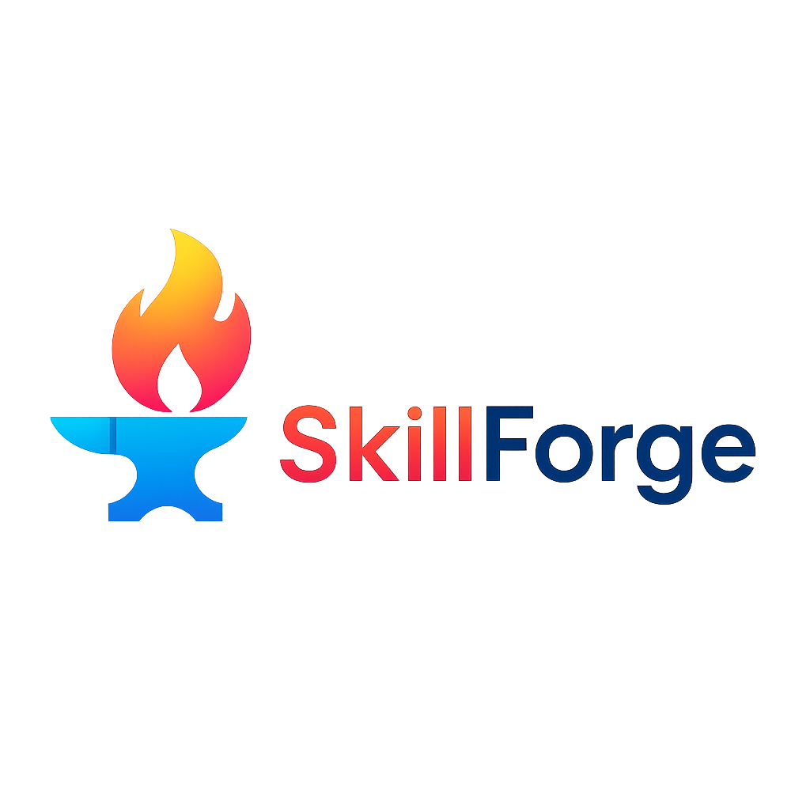

  

### The Ultimate Free Computer Science Learning Resources Hub

**Your comprehensive guide to computer science education with curated FREE resources from top institutions worldwide**

[Explore Resources](#colleges) • [View Website](https://ahmed-hamdy101.github.io/Awesome-Material/) • [Contribute](#contribute)

## 📚 Table of Contents

- [🌟 About The Project](#-about-the-project)
- [🏫 Top University Resources](#-top-university-resources)
- [💻 Programming Languages](#-programming-languages)
- [⚡ Frameworks & Technologies](#-frameworks--technologies)
- [🎨 UI Libraries & Components](#-ui-libraries--components)
- [🧠 Algorithms & Data Structures](#-algorithms--data-structures)
- [👨‍🏫 Top CS Instructors](#-top-cs-instructors)
- [📜 Certifications](#-certifications)
- [🚀 Additional Resources](#-additional-resources)
- [🤝 Contributing](#-contributing)
- [👥 Developers](#-developers)
- [📄 License](#-license)

## 🌟 About The Project

Awesome Material is a comprehensive collection of **100% free** computer science learning resources from world-renowned universities and platforms. We believe that quality education should be accessible to everyone, regardless of their financial situation.

### ✨ Features

- 🆓 **100% Free Resources** - No hidden costs, no subscriptions
- 🏆 **Top University Courses** - Harvard, MIT, Stanford, and more
- 💼 **Industry-Relevant Skills** - Programming, frameworks, algorithms
- 🎯 **Structured Learning Paths** - From beginner to advanced
- 🌍 **Global Community** - Contributors from around the world
- 📱 **Mobile Responsive** - Learn on any device

## 🏫 Top University Resources

### Harvard University
- [CS50: Introduction to Computer Science](https://www.edx.org/cs50)
- [CS50 Certificate Materials](https://cs50.harvard.edu/x/2021/)
- [Computer Security Fundamentals](https://cs50.harvard.edu/x/2021/weeks/security/)
- [Artificial Intelligence](https://cs50.harvard.edu/x/2021/weeks/ai/)

### MIT OpenCourseWare
- [MIT OpenCourseWare Portal](https://ocw.mit.edu/)
- [Python Programming Course](https://ocw.mit.edu/courses/6-00-introduction-to-computer-science-and-programming-fall-2008/)
- [Video Lectures](https://ocw.mit.edu/courses/6-00-introduction-to-computer-science-and-programming-fall-2008/video_galleries/video-lectures/)
- [Assignments & Exercises](https://ocw.mit.edu/courses/6-00-introduction-to-computer-science-and-programming-fall-2008/pages/assignments/)

### Stanford University
- [Cybersecurity Resources](https://cs50.harvard.edu/college/2021/fall/weeks/cybersecurity/)
- [Stanford Online Free Courses](https://online.stanford.edu/explore?type%5B%5D=Free)
- [Stanford Engineering](https://see.stanford.edu/)

## 💻 Programming Languages

| Language | Resources | Level |
|----------|-----------|-------|
| **Python** | [Learn Python](https://www.learnpython.org/) • [Official Tutorial](https://docs.python.org/3/tutorial/) • [freeCodeCamp](https://www.freecodecamp.org/learn/scientific-computing-with-python/) | Beginner-Advanced |
| **JavaScript** | [Modern JS Tutorial](https://javascript.info/) • [Reactively Overview](https://dev.to/modderme123/super-charging-fine-grained-reactive-performance-47ph) • [Dependency Injection](https://snyk.io/blog/dependency-injection-in-javascript/) | All Levels |
| **Kotlin** | [Kotlin Constructs](https://kau.sh/blog/important-kotlin-constructs/) • [Official Docs](https://kotlinlang.org/docs/home.html) • [Android Guides](https://developer.android.com/kotlin) | Intermediate |
| **TypeScript** | [Mapped Types](https://www.lloydatkinson.net/posts/2022/going-further-with-typescript-part-1/) • [Data Validation](https://dev.to/polyov_dev/data-validation-in-typescript-using-the-either-pattern-4omk) • [Official Docs](https://www.typescriptlang.org/docs/) | Intermediate |
| **PHP** | [PHP Basics](https://www.codingame.com/playgrounds/34845/le-php---les-bases-du-langage/introduction) • [Official PHP.net](https://www.php.net/) • [Advanced PHP](https://www.phptpoint.com/advanced-php-tutorial/) | Beginner-Advanced |
| **Node.js** | [Node.js Courses](https://www.mygreatlearning.com/node-js/free-courses) • [Official Guides](https://nodejs.org/en/docs/guides/) • [freeCodeCamp Backend](https://www.freecodecamp.org/learn/back-end-development-and-apis/) | Intermediate |

## ⚡ Frameworks & Technologies

### Backend Frameworks
- **Laravel** - [Learn Laravel](https://www.tutorialspoint.com/laravel/laravel_overview.htm)
- **Express.js** - [Official Guide](https://expressjs.com/)
- **Spring Boot** - [Spring Guides](https://spring.io/guides)

### Full Stack Frameworks
- **CodeIgniter** - [Learn CodeIgniter](https://www.tutorialspoint.com/codeigniter/index.htm)
- **Next.js** - [Learn Next.js](https://www.tutorialspoint.com/nextjs/index.htm)
- **Vue.js** - [Vue.js Guide](https://vuejs.org/guide/introduction.html)

## 🎨 UI Libraries & Components

Discover beautiful, modern UI libraries to accelerate your frontend development:

| Library | Description | Link |
|---------|-------------|------|
| **shadcn/ui** | Re-usable components built with Radix UI | [Visit](https://ui.shadcn.com) |
| **Magic UI** | Beautiful animated components & templates | [Visit](https://magicui.design) |
| **Aceternity UI** | Modern copy-paste ready components | [Visit](https://ui.aceternity.com) |
| **HyperUI** | Free Tailwind CSS components | [Visit](https://www.hyperui.dev) |
| **Preline UI** | Open-source UI component library | [Visit](https://preline.co) |
| **Hover.dev** | Interactive components (some paid) | [Visit](https://www.hover.dev) |

**More UI Libraries:**
- [UI Layouts](https://www.ui-layouts.com/) • [Eldora UI](https://www.eldoraui.site) • [Cuicui](https://cuicui.day)
- [Indie Starter UI](https://ui.indie-starter.dev) • [Flash UI](https://flashui.site) • [Fancy Components](https://www.fancycomponents.dev)
- [21st.dev](https://21st.dev) • [Tailus](https://html.tailus.io) • [Ground UI](https://ground.bossadizenith.me)
- [React Components](https://reactcomponents.com) • [Ever UI](https://www.ever-ui.com) • [Atomix UI](https://atomix-ui.vercel.app)
- [Kokonut UI](https://kokonutui.com) • [Bun UI](https://bundui.io) • [Hexta UI](https://hextaui.com)
- [Origin UI](https://originui.com) • [Just D](https://getjustd.com)

## 🧠 Algorithms & Data Structures

Master essential computer science concepts for technical interviews and problem solving:

### Core Concepts
- [Graph Theory](https://www.youtube.com/playlist?list=PLDV1Zeh2NRsDGO4--qE8yH72HFL1Km93P)
- [Big O Notation](https://www.geeksforgeeks.org/analysis-algorithms-big-o-analysis/)
- [Recursion](https://www.geeksforgeeks.org/introduction-to-recursion-data-structure-and-algorithm-tutorials/)

### Data Structures
- [Stack](https://www.geeksforgeeks.org/stack-data-structure/)
- [Queue](https://www.geeksforgeeks.org/queue-data-structure/)
- [Linked List](https://www.geeksforgeeks.org/data-structures/linked-list/)
- [Hash Table](https://www.tutorialspoint.com/data_structures_algorithms/hash_data_structure.htm)
- [AVL Tree](https://www.geeksforgeeks.org/insertion-in-an-avl-tree/)

### Sorting Algorithms
- [Bubble Sort](https://www.geeksforgeeks.org/bubble-sort/)
- [Merge Sort](https://www.geeksforgeeks.org/merge-sort/)
- [Quick Sort](https://www.geeksforgeeks.org/quick-sort/)
- [Insertion Sort](https://www.tutorialspoint.com/data_structures_algorithms/array_data_structure.htm)

### Practice Platforms
- [LeetCode](https://leetcode.com/) - Coding interview practice
- [HackerRank](https://www.hackerrank.com/) - Competitive programming
- [freeCodeCamp Algorithms](https://www.freecodecamp.org/learn/javascript-algorithms-and-data-structures/)
- [VisualGo](https://visualgo.net/en) - Algorithm visualizations

## 👨‍🏫 Top CS Instructors

Learn from the world's most renowned computer science educators:

### Andrew Ng
- **Specialization**: Machine Learning & AI
- **Background**: Co-founder of Coursera, Stanford Adjunct Professor, founder of DeepLearning.AI
- **Courses**: [Machine Learning Specialization](https://www.coursera.org/learn/machine-learning?specialization=machine-learning-introduction#syllabus)

### Eric Grimson
- **Specialization**: MIT Professor & CS Educator
- **Background**: Chancellor for Academic Advancement at MIT
- **Courses**: [MIT Python Course](https://ocw.mit.edu/courses/6-00-introduction-to-computer-science-and-programming-fall-2008/)

### David Malan
- **Specialization**: Harvard CS50 Instructor
- **Background**: Gordon McKay Professor of the Practice of Computer Science at Harvard
- **Courses**: [CS50: Intro to Computer Science](https://cs50.harvard.edu/)

## 📜 Certifications

Boost your career with industry-recognized certifications:

### IT Certifications
- [Red Hat Certified System Administrator](https://www.redhat.com/en/services/certification/rhcsa)
- [MCSA: Windows Server 2012](https://learn.microsoft.com/en-us/certifications/mcsa-windows-server-certification/)
- [CEH - Certified Ethical Hacker](https://www.eccouncil.org/programs/certified-ethical-hacker-ceh/)
- [CCNA - Cisco Certified](https://www.cisco.com/c/en/us/training-events/training-certifications/certifications/associate/ccna.html)

### CS Certifications
- [CS50 - Harvard Certificate](https://cs50.harvard.edu/x/2021/certificate/)
- [Developing Android Apps](https://www.udacity.com/course/new-android-fundamentals--ud851)
- [HMS - Huawei Mobile Services](https://developer.huawei.com/consumer/en/training/exam-home/101616662449026754)
- [freeCodeCamp Certifications](https://www.freecodecamp.org/learn)

### Cybersecurity
- **Security+** - Foundational security skills
- [CISSP](https://www.isc2.org/Certifications/CISSP) - Advanced security certification
- **CISM** - Information security management
- [OSCP](https://www.offensive-security.com/pwk-oscp/) - Penetration testing certification

## 🚀 Additional Resources

### Machine Learning & AI
- [Supervised Machine Learning Course](https://www.coursera.org/learn/machine-learning?specialization=machine-learning-introduction#syllabus)
- [Fast.ai - Practical Deep Learning](https://www.fast.ai/)
- [Google ML Crash Course](https://developers.google.com/machine-learning/crash-course)

### Reverse Engineering
- [Reverse Engineering Guide](https://0xinfection.github.io/reversing/)
- [Begin RE - Reverse Engineering](https://www.begin.re/)
- [Malware Unicorn Workshops](https://malwareunicorn.org/#/workshops)

### Security
- [Cryptography Tutorial](https://www.tutorialspoint.com/cryptography/index.htm)
- [SSH Essentials](https://www.digitalocean.com/community/tutorials/ssh-essentials-working-with-ssh-servers-clients-and-keys)
- [Linux Tutorial](https://www.javatpoint.com/linux-tutorial)

### Clean Code & Best Practices
- [Clean Code Book](https://drive.google.com/file/d/1OMX1qEo24oTdAxofz2y1zXrtfFDuAbm5/view?usp=share_link)
- [Refactoring Guru](https://refactoring.guru/)
- [Clean Code JavaScript](https://github.com/ryanmcdermott/clean-code-javascript)

### Interview Preparation
- [Tech Interview Resources](https://www.techseries.dev/)
- [Interview Cake](https://www.interviewcake.com/)
- [Coding Interview University](https://github.com/jwasham/coding-interview-university)

### iOS Development on Windows
- [VMware macOS Installation](https://o7planning.org/10569/install-mac-os-virtual-machine-in-vmware)
- [Xcode Resources](https://developer.apple.com/xcode/resources/)
- [Ray Wenderlich iOS Tutorials](https://www.raywenderlich.com/ios/paths/learn)

## 🤝 Contributing

We welcome contributions from everyone! Help us make this the most comprehensive collection of free computer science resources.

### How to Contribute

1. **Fork** the repository
2. **Add** new resources or improve existing ones
3. **Submit** a pull request
4. **Join** our community of contributors

### Contribution Ideas
- Add new free courses and resources
- Fix broken links
- Improve documentation
- Add translations
- Suggest new categories

## 👥 Developers

### Ahmed Hamdy
- **Role**: Full Stack Developer & PHP DEVELOPER
- **GitHub**: [Ahmed-Hamdy101](https://github.com/Ahmed-Hamdy101)
- **Focus**: Web Development, Open Source Education

### Mina Sameh
- **Role**: MERN & NodeJS Backend Developer 
- **GitHub**: [MinaSameh1](https://github.com/MinaSameh1)
- **Focus**: Software Development, Community Building

## 📄 License

This project is licensed under the MIT License - see the [LICENSE](LICENSE) file for details.

---

### ⭐ Star this repository if you find it helpful!

**Let's make quality computer science education accessible to everyone** 🌍

[Explore Website](https://ahmed-hamdy101.github.io/Awesome-Material/) • [Report Issue](https://github.com/Ahmed-Hamdy101/Awesome-Material/issues) • [Request Feature](https://github.com/Ahmed-Hamdy101/Awesome-Material/issues)

